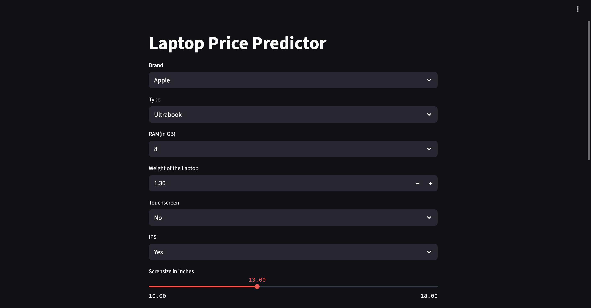
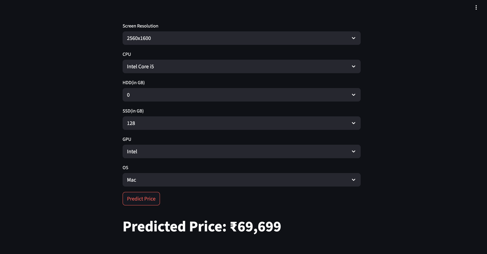

# Laptop Price Prediction 💻

Developed a machine learning model and deployed it as an interactive web application that predicts the price of a laptop based on its technical specifications. This end-to-end project covers the complete data science lifecycle from data cleaning and exploratory analysis to model deployment.

### 🚀 Live Demo
The most effective way to understand this project is to interact with it directly. The application is deployed and publicly accessible.

[Project Demo](https://laptoppp-adnan.onrender.com/)

### 🎯 Project Objective
The laptop market is vast and complex, with thousands of configurations and often opaque pricing structures that can be confusing for consumers. The goal of this project is to build a robust machine learning model that demystifies laptop pricing by providing a data-driven tool to estimate a laptop's fair market value based on its core specifications. This empowers both consumers to make informed purchasing decisions and sellers to price their products competitively.

### Key Features
Accurate Price Prediction: Utilizes a Random Forest Regressor model, chosen for its high accuracy and robustness in handling complex, non-linear relationships in the data.

Interactive & User-Friendly Web Interface: Built with Streamlit, the web app provides an intuitive interface for users to input laptop specifications and receive instant price predictions.

In-depth Market Analysis: The underlying model is built upon a thorough exploratory data analysis (EDA) that reveals key market trends and price drivers, such as the premium on certain brands, display types, and storage configurations.

End-to-End Pipeline: Demonstrates a complete machine learning workflow, from raw data ingestion and cleaning to model training, evaluation, and deployment as a user-facing application.

## 🛠️ Architecture and Technology Stack
This project follows a standard yet powerful architecture for transforming a static dataset into a dynamic, predictive web application. The structured flow ensures reproducibility and clarity.

### System Architecture
A text-based representation of the project's data and model pipeline:

### Technology Stack
The project leverages a curated set of industry-standard Python libraries and frameworks, demonstrating proficiency in the modern data science toolkit.

* Data Analysis & Manipulation: Pandas, NumPy

* Data Visualization: Matplotlib, Seaborn

* Machine Learning: Scikit-learn

* Web Framework & Deployment: Streamlit

* Programming Language: Python

## 🔬 Deconstructing the Machine Learning Pipeline
This section details the methodical process of building the prediction engine, from understanding the raw data to evaluating the final model. This structured approach is crucial for building a reliable and accurate model.

### Data Sourcing and Description
The project utilizes a popular and comprehensive dataset from Kaggle, which contains specifications for over 1,300 distinct laptop models. The dataset's richness allows for a nuanced analysis of the factors influencing price.

The table below provides a structured overview of the features available in the raw dataset. Understanding these features and their initial data types is the first step in the feature engineering process, as many columns like Ram and Weight are not in a machine-readable numerical format initially.

### Feature Engineering and Data Preprocessing
The raw dataset, while comprehensive, requires significant cleaning and transformation to be suitable for machine learning. This stage is critical for extracting maximum value from the data.

* Numeric Conversion: Columns like Ram and Weight were parsed to remove non-numeric characters (e.g., '8GB' → 8, '1.37kg' → 1.37).

* Feature Extraction: Complex categorical columns were deconstructed into multiple, more informative binary and numerical features. This process creates signals that the model can more easily interpret.

* ScreenResolution: This column was parsed to extract Touchscreen capability (1 or 0), IPS Panel status (1 or 0), and the screen's pixel density (PPI), which was calculated from the X and Y resolutions.

* Cpu: The CPU string was broken down to extract the CPU Brand (e.g., Intel, AMD) and the specific processor series (e.g., Core i5, Core i7, Ryzen 7).

* Memory: The Memory column was engineered into four distinct numerical columns: HDD, SSD, Hybrid, and Flash_Storage, capturing the capacity of each storage type.

* Categorical Encoding: After feature extraction, remaining categorical columns like Company, TypeName, and OpSys were converted into a numerical format using One-Hot Encoding.

* Exploratory Data Analysis (EDA)
Before modeling, an extensive EDA was performed to uncover patterns, validate assumptions, and guide feature engineering.

* Target Variable Distribution: The target variable, Price, was found to be heavily right-skewed. A log transformation (log(Price)) was applied to normalize its distribution, a standard practice that often helps linear-based models and improves the performance of tree-based models by stabilizing variance.

* Price Correlations: As expected, EDA revealed strong positive correlations between price and features like Ram, SSD capacity, and PPI. This confirms that higher-spec components generally lead to higher prices.

* Categorical Insights: Visualizations showed that laptops categorized as Gaming or Ultrabook command a significant price premium over standard Notebooks. Similarly, brands like Apple and Razer occupy the higher end of the price spectrum, while laptops with IPS panels are priced significantly higher than those without.

* Modeling and Evaluation
A systematic approach was taken to select, train, and evaluate the best-performing model.

* Model Selection: Several regression algorithms were evaluated, including Linear Regression, Ridge, Lasso, and Random Forest. The Random Forest Regressor was ultimately selected due to its superior performance and its ability to capture complex interactions between features without extensive hyperparameter tuning.

* Model Training Pipeline: To ensure robustness and prevent data leakage, a Scikit-learn Pipeline was constructed. This pipeline encapsulates all preprocessing steps (e.g., one-hot encoding, column transformations) and the final model, making the entire workflow streamlined and easily reproducible.

* Evaluation Metrics: The final model's performance was rigorously assessed on a held-out test set. The results demonstrate a high level of predictive accuracy.

* R² Score: 0.89

* Mean Absolute Error (MAE): 85.50 (INR)

## ⚙️ How to Run Locally
To run this project on your local machine, please follow the steps below. The instructions assume you have Python 3.11+ and pip installed.

Clone the repository:

Create and activate a virtual environment (Recommended):
Using a virtual environment is a best practice to manage project dependencies and avoid conflicts.

Install the required dependencies:
The requirements.txt file lists all the necessary libraries.

Run the Streamlit application:
This command will start a local web server and open the application in your default web browser.

You can then access the application at http://localhost:8501.

## 🖼️ Application Showcase
The following screenshots provide a visual tour of the application's user interface and functionality. They serve as a quick preview for those who may not run the live demo.

Application User Interface
This shows the main interface with all the input fields a user can configure to specify their desired laptop.

Example Prediction Result
This screenshot captures the application after a user has entered their specifications and received a price prediction from the model.

## 🤝 How to Contribute
Contributions, issues, and feature requests are welcome! If you have suggestions for improvement, please feel free to open an issue or submit a pull request on GitHub.

